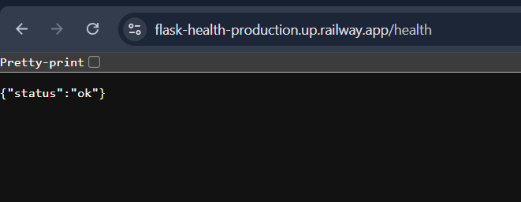
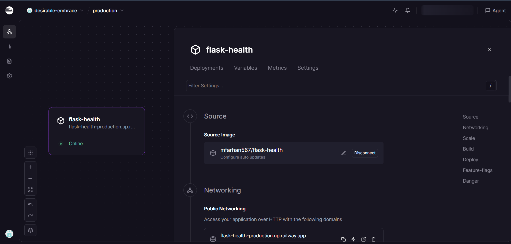
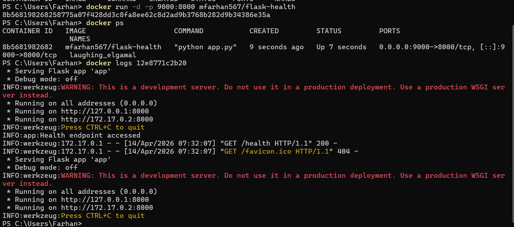
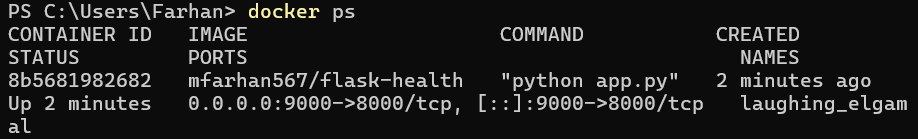
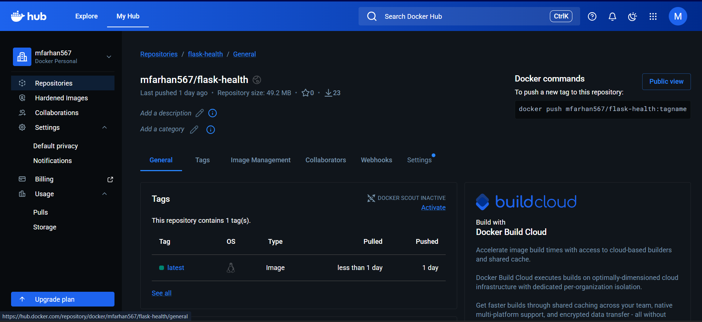
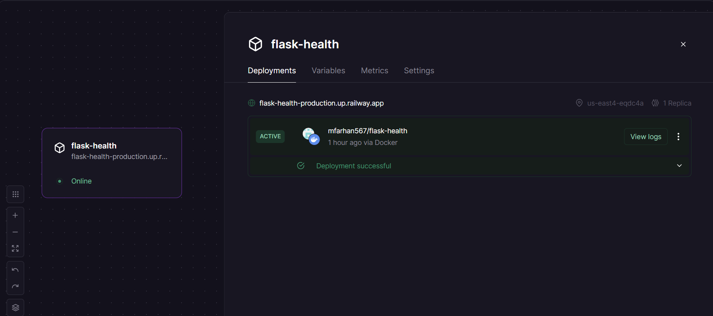
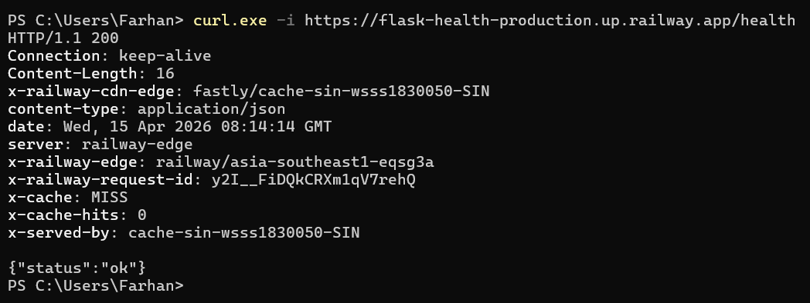

# Laporan Penugasan Docker — NCC Oprec 2026

**Nama:** Muhammad Farhan
**NRP:** 5054241018
**Platform Deployment:** Railway (pengganti VPS konvensional)
**Docker Hub:** `mfarhan567/flask-health`

---

## Daftar Isi

1. Deskripsi Singkat Service
2. Penjelasan Endpoint `/health`
3. Struktur Proyek
4. Penjelasan File Konfigurasi
   - 4.1 Dockerfile
   - 4.2 docker-compose.yml
5. Proses Build dan Run Docker (Lokal)
   - 5.1 Build Image
   - 5.2 Menjalankan Container
   - 5.3 Verifikasi dengan Docker Logs
   - 5.4 Menjalankan dengan Docker Compose
6. Push Image ke Docker Hub
7. Proses Deployment ke Railway
   - 7.1 Alasan Menggunakan Railway
   - 7.2 Langkah Deployment
8. Bukti Endpoint Dapat Diakses
9. Kendala yang Dihadapi

---

## 1. Deskripsi Singkat Service

Service yang dibuat adalah REST API sederhana berbasis **Python Flask** yang berjalan di dalam Docker container. Service ini bertujuan memenuhi kebutuhan health check yang umum digunakan dalam arsitektur microservice maupun pipeline CI/CD.

Service hanya memiliki satu endpoint fungsional, yaitu `/health`, yang dapat diakses secara publik setelah deployment ke Railway. Base image yang digunakan adalah `python:3.9-slim` untuk menjaga ukuran image tetap kecil.

---

## 2. Penjelasan Endpoint `/health`

| Properti      | Detail               |
| ------------- | -------------------- |
| URL           | `/health`          |
| Method        | `GET`              |
| Response Code | `200 OK`           |
| Content-Type  | `application/json` |
| Response Body | `{"status": "ok"}` |

Endpoint ini berfungsi sebagai health check standar. Ketika dipanggil, service akan mengembalikan respons JSON dengan status `ok` dan HTTP code `200`. Pola ini umum digunakan sebagai sinyal bahwa container berjalan normal dan siap menerima traffic.

Contoh respons saat endpoint diakses:

```json
{
  "status": "ok"
}
```

Log yang tercatat di container saat endpoint diakses:

```
INFO:app:Health endpoint accessed
INFO:werkzeug:172.17.0.1 - - [14/Apr/2026 07:17:51] "GET /health HTTP/1.1" 200 -
```

---

## 3. Struktur Proyek

```
Oprec_2026_Pertemuan_1-main/
├── app.py                  # Source code Flask utama
├── requirements.txt        # Dependensi Python
├── Dockerfile              # Konfigurasi Docker image
├── docker-compose.yml      # Orkestrasi container
├── LAPORAN_DOCKER.md       # Dokumen laporan utama
├── README.md               # Ringkasan proyek
├── log.txt                 # Bukti command dan output Docker
└── deployment-log.txt      # Transcript sesi deployment
```

---

## 4. Penjelasan File Konfigurasi

### 4.1 Dockerfile

```dockerfile
FROM python:3.9-slim

WORKDIR /app

COPY requirements.txt .
RUN pip install -r requirements.txt

COPY . .

CMD ["python", "app.py"]
```

Penjelasan setiap instruksi:

- `FROM python:3.9-slim` — Menggunakan base image Python versi 3.9 varian slim untuk meminimalkan ukuran image. Ukuran akhir image sekitar **207MB** (dibanding `python:3.9` penuh yang bisa mencapai 900MB+).
- `WORKDIR /app` — Menetapkan direktori kerja di dalam container. Semua perintah berikutnya akan dijalankan dari `/app`.
- `COPY requirements.txt .` — Menyalin file dependensi terlebih dahulu sebelum source code. Ini memanfaatkan Docker layer caching: selama `requirements.txt` tidak berubah, layer instalasi pip akan di-cache dan build berikutnya jauh lebih cepat.
- `RUN pip install -r requirements.txt` — Menginstal semua dependensi Python yang dibutuhkan Flask.
- `COPY . .` — Menyalin seluruh source code ke dalam container. Dilakukan setelah instalasi dependensi agar perubahan kode tidak membatalkan cache layer dependensi.
- `CMD ["python", "app.py"]` — Perintah yang dijalankan saat container start.

### 4.2 docker-compose.yml

```yaml
services:
  api:
    build: .
    ports:
      - "8003:8000"
```

Penjelasan:

- `build: .` — Membangun image dari Dockerfile di direktori saat ini.
- `ports: "8003:8000"` — Memetakan port 8003 host ke port 8000 container. Format: `[host_port]:[container_port]`.

## 5. Proses Build dan Run Docker (Lokal)

### 5.1 Build Image

Perintah untuk membangun image dari Dockerfile:

```bash
docker build -t flask-health .
```

Output build yang berhasil:

```
[+] Building 1.5s (10/10) FINISHED
 => [internal] load build definition from Dockerfile
 => [internal] load metadata for docker.io/library/python:3.9-slim
 => [internal] load .dockerignore
 => [internal] load build context
 => CACHED [2/5] WORKDIR /app
 => CACHED [3/5] COPY requirements.txt .
 => CACHED [4/5] RUN pip install -r requirements.txt
 => [5/5] COPY . .
 => exporting to image
 => naming to docker.io/library/flask-health:latest
```

Terlihat bahwa layer `[2/5]`, `[3/5]`, dan `[4/5]` menggunakan cache (`CACHED`), yang menunjukkan optimasi build berjalan dengan benar karena `requirements.txt` tidak berubah.

### 5.2 Menjalankan Container

Menjalankan container dari image yang sudah dibangun:

```bash
docker run -d -p 8003:8000 flask-health
```

Penjelasan flag:

- `-d` — Detached mode, container berjalan di background.
- `-p 8003:8000` — Memetakan port 8003 di host ke port 8000 di container. Endpoint dapat diakses di `http://localhost:8003/health`.

### 5.3 Verifikasi dengan Docker Logs

Memeriksa log container untuk memastikan service berjalan:

```bash
docker logs 2b65cbdb38ca
```

Output yang dihasilkan:

```
 * Serving Flask app 'app'
 * Debug mode: off
INFO:werkzeug:WARNING: This is a development server. ...
 * Running on all addresses (0.0.0.0)
 * Running on http://127.0.0.1:8000
 * Running on http://172.17.0.5:8000
INFO:app:Health endpoint accessed
INFO:werkzeug:172.17.0.1 - - [14/Apr/2026 07:17:51] "GET /health HTTP/1.1" 200 -
```

Log `"GET /health HTTP/1.1" 200` mengkonfirmasi endpoint berhasil merespons dengan status 200 OK.

### 5.4 Menjalankan dengan Docker Compose

Untuk menjalankan service menggunakan Docker Compose:

```bash
docker compose up -d
```

Untuk menghentikan:

```bash
docker compose down
```

Output saat `docker compose up -d` berhasil:

```
[+] up 3/3
 ✔ Image oprec_2026_pertemuan_1-main-api       Built     3.0s
 ✔ Network oprec_2026_pertemuan_1-main_default Created   0.1s
 ✔ Container oprec_2026_pertemuan_1-main-api-1 Started   0.4s
```

---

## 6. Push Image ke Docker Hub

Image yang sudah dibangun di-push ke Docker Hub agar dapat digunakan pada environment deployment.

```bash
# Memberi tag sesuai format Docker Hub
docker tag flask-health mfarhan567/flask-health

# Push ke Docker Hub
docker push mfarhan567/flask-health
```

Output push yang berhasil:

```
Using default tag: latest
The push refers to repository [docker.io/mfarhan567/flask-health]
f3b88752d60e: Pushed
99a020f6d014: Pushed
...
latest: digest: sha256:68904d41d82012217bd3b08b05f657bb65ff9506772aa8b471c44cc3413a4ee1 size: 856
```

Image publik tersedia di: `docker.io/mfarhan567/flask-health:latest`

Verifikasi dengan pull dari Docker Hub pada environment baru:

```bash
docker pull mfarhan567/flask-health
docker run -d -p 9000:8000 mfarhan567/flask-health
```

---

## 7. Proses Deployment ke Railway

### 7.1 Alasan Menggunakan Railway

Deployment awalnya direncanakan menggunakan VPS konvensional (DigitalOcean, Google Cloud, Oracle Cloud). Namun terdapat kendala berulang pada proses verifikasi pembayaran di semua platform tersebut (kartu ditolak, verifikasi gagal). Oleh karena itu, Railway dipilih sebagai alternatif karena:

- Tidak memerlukan kartu kredit untuk tier gratis.
- Mendukung deployment langsung dari Docker image di Docker Hub maupun dari GitHub repository.
- Menghasilkan public URL secara otomatis tanpa konfigurasi DNS manual.
- Cocok untuk deployment cepat service sederhana seperti health check API ini.

### 7.2 Langkah Deployment

**Langkah 1 — Persiapan akun Railway**

Buat akun di [railway.app](https://railway.app) menggunakan GitHub OAuth. Tidak diperlukan kartu kredit untuk memulai.

**Langkah 2 — Buat project baru**

Dari dashboard Railway, klik **New Project** lalu pilih salah satu dari dua opsi:

- **Deploy from GitHub repo** — Railway akan otomatis mendeteksi Dockerfile dan melakukan build.
- **Deploy Docker Image** — Masukkan nama image dari Docker Hub: `mfarhan567/flask-health`.

**Langkah 3 — Konfigurasi environment variable**

Di tab **Variables** pada project Railway, tambahkan:

```
PORT=8000
FLASK_ENV=production
```

Railway secara otomatis akan meng-inject variabel `PORT` dan menggunakannya untuk routing internal.

**Langkah 4 — Konfigurasi port**

Di tab **Settings > Networking**, masukkan port `8000` pada kolom **Public Networking** agar Railway menghasilkan public URL yang mengarah ke port tersebut.

**Langkah 5 — Generate public domain**

Railway secara otomatis menghasilkan domain publik dengan format:

```
https://flask-health-production-xxxx.up.railway.app
```

**Langkah 6 — Verifikasi endpoint**

Akses endpoint health check melalui URL publik:

```
https://flask-health-production-xxxx.up.railway.app/health
```

Respons yang diharapkan:

```json
{
  "status": "ok"
}
```

---

## 8. Bukti Endpoint Dapat Diakses

**Screenshot 1 — Endpoint `/health` diakses via browser**



Screenshot 2 — Railway Dashboard



**Screenshot 3 — Docker logs menampilkan 200 OK**


**Screenshot 4 — Docker Desktop atau `docker ps` menampilkan container running**



**Screenshot 5 — Docker Hub menampilkan image `mfarhan567/flask-health`**



**Screenshot 6 — Railway dashboard menampilkan deployment berhasil**


**Screenshot 7 — Endpoint publik diuji via `curl` **



---

## 9. Kendala yang Dihadapi

### 9.1 Kegagalan Verifikasi Pembayaran VPS

Kendala utama yang dihadapi adalah kegagalan pada proses verifikasi pembayaran saat mencoba menggunakan beberapa platform VPS konvensional, yaitu:

* **DigitalOcean** — Proses penambahan metode pembayaran tidak berhasil sehingga tidak dapat membuat Droplet.
* **Google Cloud** — Akun berada pada status *free trial pending* akibat proses verifikasi pembayaran yang belum selesai.
* **Oracle Cloud** — Pendaftaran *free tier* tidak dapat diselesaikan pada tahap verifikasi kartu.

Ketiga platform tersebut mensyaratkan metode pembayaran yang valid untuk proses verifikasi, meskipun menyediakan layanan gratis dalam bentuk *trial* atau  *free tier* . Dalam kasus ini, metode pembayaran yang digunakan tidak berhasil melewati proses verifikasi tersebut.

**Solusi yang diambil:**

Sebagai alternatif, deployment dilakukan menggunakan  **Railway** , yang memungkinkan penggunaan Docker image secara langsung tanpa proses verifikasi kartu yang kompleks pada tahap awal. Platform ini juga menyediakan *public URL* secara otomatis, sehingga endpoint dapat diakses secara publik sesuai dengan kebutuhan tugas.
