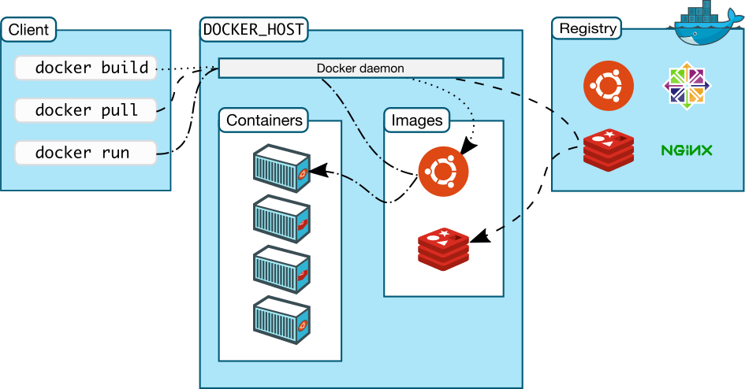
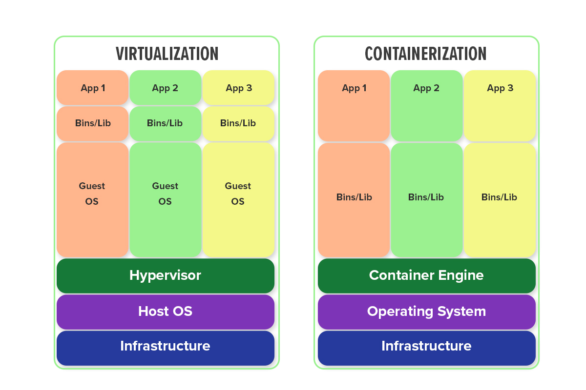
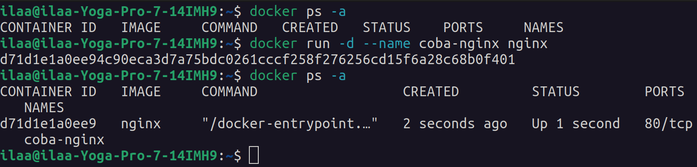
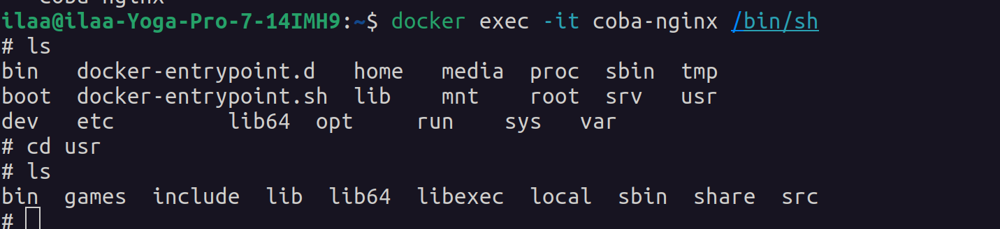
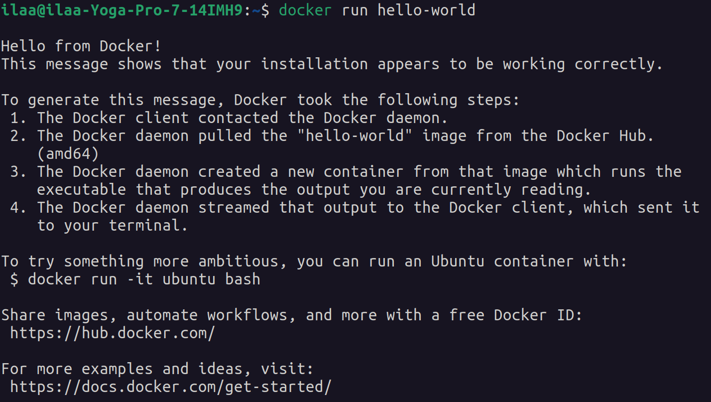
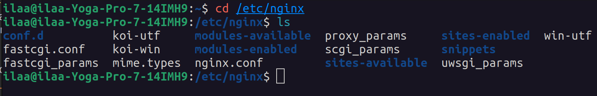
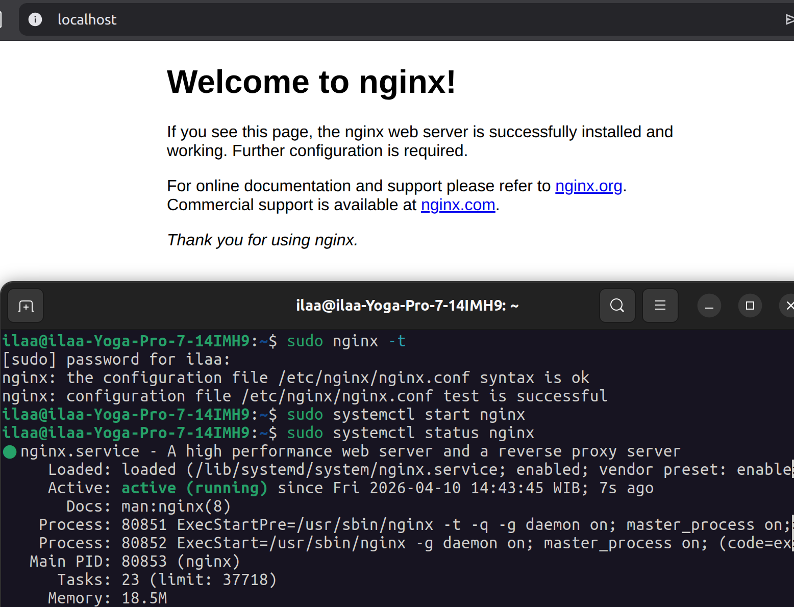
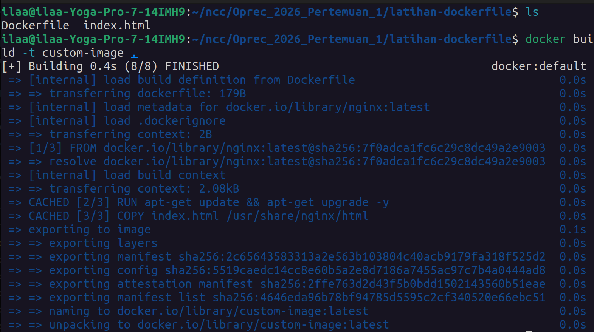
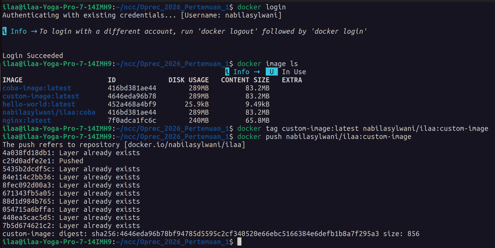
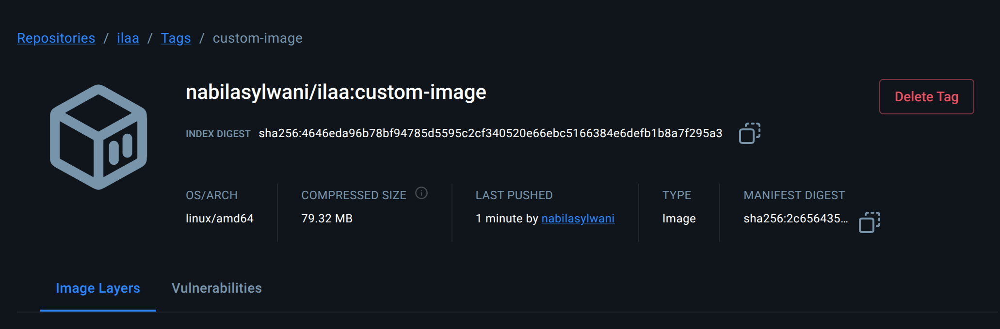

# Oprec_2026_Pertemuan_1

## Prasyarat

### Install Docker

Sebelum masuk ke Materi 1 Open Recruitment NCC 2026 yang membahas Docker, pastikan Docker sudah terpasang di laptop atau komputer kalian. Kalau belum, silakan install terlebih dahulu sesuai dengan sistem operasi yang digunakan.

#### Linux

Kalau kalian menggunakan Linux, silakan install Docker dengan mengikuti panduan resmi berikut, lalu pilih instruksi sesuai dengan distro yang digunakan: [Docker Installation Guide](https://docs.docker.com/engine/install/)


#### Windows
 
1. Pastikan bahwa WSL2 sudah terinstall, jika belum, ikuti langkah-langkah di [Instalasi WSL 2](https://pureinfotech.com/install-windows-subsystem-linux-2-windows-10/) (hanya berlaku untuk versi win 10 versi 2004 ke atas, termasuk win11)
2. Download installer docker desktop di [Instalasi Docker](https://www.docker.com/products/docker-desktop) (ukuran 490 MB) (docker desktop sudah include docker engine dan docker compose)
3. Jalankan installernya, lalu pencet  ok/ install, lalu tunggu selama sekitar 2 menit
4. Docker sudah terinstall

> Jika muncul peringatan `WSL 2 requires an update to its kernel component.` ketika aplikasi dijalankan, download link berikut: [WSL Update x64](https://wslstorestorage.blob.core.windows.net/wslblob/wsl_update_x64.msi), jalankan setup wizard yang sudah didownload, kemudian buka kembali aplikasi docker

#### MacOS
_kebutuhan sistem minimal: macOS versi 11 dengan ram 4 GB_

##### GUI
1. Download installer melalui link berikut: [Instalasi Docker](https://www.docker.com/products/docker-desktop)
2. Jalankan installernya, kemudian drag ikon Docker menuju ikon folder _Application_ 
3. Jalankan aplikasinya dari Launchpad atau folder _Application_
4. Jika muncul peringatan "Are you sure you want to open it?", tekan open
5. Baca terms and condition dan tekan accept
6. Pilih recommended setting dan tekan ok
7. Masukkan password mac dan tunggu hingga proses selesai

##### Terminal
1. Cek apakah Homebrew sudah terinstall
    ```
    brew --version
    ```
2. Jika belum, install homebrew terlebih dahulu
    ```
    /bin/bash -c "$(curl -fsSL https://raw.githubusercontent.com/Homebrew/install/master/install.sh)"
    ```
3. Install docker
    ```
    brew install --cask docker
    ```
4. Jalankan docker
    ```
    open /Applications/Docker.app
    ```
5. Jika muncul peringatan "Are you sure you want to open it?", tekan open
6. Baca terms and condition dan tekan accept
7. Pilih recommended setting dan tekan ok
8. Masukkan password mac dan tunggu hingga proses selesai

## Pengenalan Docker

### Apa itu Docker?


Docker adalah platform yang digunakan untuk membuat, mengemas, dan menjalankan aplikasi di dalam sebuah wadah yang disebut **container**. Container ini berisi semua kebutuhan aplikasi, mulai dari kode, library, runtime, hingga dependensi lainnya.

Dengan Docker, aplikasi bisa dijalankan di mana saja dengan hasil yang sama, baik itu di laptop pribadi, server, maupun cloud. Dengan kata lain, developer tidak perlu lagi repot mengatur environment di setiap perangkat karena semua sudah dibungkus di dalam container.

### Arsitektur Docker



#### Docker Daemon
Docker Daemon adalah “mesin utama” Docker yang berjalan di background sistem. Tugasnya adalah mengelola seluruh Docker object, seperti container, image, network, dan lainnya. 

Docker Daemon ini terhubung dengan Docker Client, sehingga setiap perintah yang dijalankan oleh user melalui Docker Client akan dikirim ke Docker Daemon untuk diproses dan dieksekusi. Selain itu, Docker Daemon juga bertanggung jawab untuk mengelola penggunaan sumber daya host OS, seperti CPU, memori, dan jaringan yang digunakan oleh Docker object.

#### Docker Client
Docker Client adalah antarmuka yang digunakan pengguna untuk berinteraksi dengan Docker. Biasanya berupa command-line (CLI) seperti terminal, tetapi juga bisa berupa GUI seperti Docker Desktop.

#### Docker Objects
Docker Objects adalah komponen dasar yang digunakan dalam Docker untuk menjalankan aplikasi. Beberapa di antaranya:
- `Image`: Template atau blueprint untuk membuat container
- `Container`: Instance dari image yang sedang berjalan
- `Volume`: Media penyimpanan data yang terhubung dengan host
- `Network`: Mengatur komunikasi antar container

#### Docker Registry 
Docker Registry adalah repositori yang digunakan untuk menyimpan dan mendistribusikan Docker image. Dengan Docker Registry, kita dapat mengunduh image yang sudah ada, menyimpan image yang kita buat, serta berbagi image dengan orang lain.

Salah satu registry yang paling umum digunakan adalah Docker Hub, yang menyediakan banyak image publik siap pakai. Selain itu, kita juga dapat menggunakan private registry untuk kebutuhan internal atau keamanan. 

### Kelebihan dan Kekurangan Docker

| Kelebihan | Kekurangan |
|------------|------------|
| **Isolasi**: Docker Container memungkinkan aplikasi dan dependensinya diisolasi dalam lingkungan yang terpisah, sehingga tidak saling mempengaruhi. | **Kompleksitas Konfigurasi**: Konfigurasi Docker dapat menjadi kompleks, terutama untuk aplikasi yang lebih kompleks dengan banyak komponen atau dependensi. |
| **Portabilitas**: Docker memungkinkan aplikasi untuk dikemas dalam container yang dapat dijalankan di berbagai lingkungan, termasuk mesin lokal, cloud, atau lingkungan produksi. | **Keamanan**: Docker Container berbagi kernel sistem operasi host, sehingga menghadirkan potensi kerentanan keamanan jika tidak dikonfigurasi dengan benar. |
| **Efisiensi**: Docker Container memungkinkan penggunaan sumber daya yang efisien, dengan pengurangan overhead sistem operasi dan penggunaan sumber daya yang lebih ringan daripada virtualisasi tradisional. | **Pengelolaan Jaringan**: Pengaturan jaringan untuk container Docker bisa rumit, terutama ketika harus mengatur jaringan lintas host. |
| **Skalabilitas**: Docker memungkinkan aplikasi untuk dikemas sebagai layanan yang dapat dengan mudah diatur untuk berjalan pada beberapa container, memfasilitasi skalabilitas horizontal dan pengelolaan aplikasi yang mudah. | **Pemantauan**: Pemantauan Docker Container dapat lebih rumit dibandingkan dengan lingkungan tradisional, memerlukan perhatian ekstra dalam mengelola kesehatan dan kinerja container. |
| **Komunitas**: Docker memiliki komunitas yang luas yang membantu dalam perkembangan Docker itu sendiri. | **Pembelajaran Awal**: Docker memerlukan pemahaman konsep yang cukup untuk dapat menggunakannya secara efektif, yang mungkin memerlukan waktu untuk belajar bagi pengguna yang belum terbiasa dengan teknologi container. |

### Apa Bedanya Dengan Virtualization? 

Virtualisasi adalah proses membuat mesin virtual (virtual machine/VM) di dalam sebuah komputer fisik. Misalnya, kalian menggunakan laptop dengan OS Windows, lalu membuat VM dengan OS Ubuntu. Dalam kasus ini, Ubuntu berjalan sebagai `guest OS` di dalam `host OS` (Windows). 

Artinya, dalam satu komputer kalian bisa menjalankan dua sistem operasi sekaligus. Masing-masing berjalan secara terpisah, jadi aktivitas di satu OS tidak akan mempengaruhi OS lainnya, seolah-olah keduanya adalah komputer yang berbeda.

Namun, setiap VM membutuhkan resource sendiri seperti CPU, RAM, dan storage. Semakin banyak VM yang dijalankan, semakin besar juga resource yang digunakan. 

Berbeda dengan virtualization, containerization tidak membuat sistem operasi baru. Container hanya membungkus aplikasi beserta semua dependensinya ke dalam satu paket yang bisa dijalankan di mana saja. 

Karena Docker tidak membawa sistem operasi sendiri, maka penggunaan container tetap bergantung pada kernel OS yang kompatibel. Oleh karena itu, pada sistem seperti Windows dan macOS, Docker menggunakan lapisan tambahan seperti WSL2 atau virtual machine untuk menyediakan kernel Linux yang dibutuhkan oleh container.


#### Virtualization vs Containerization


- Virtualisasi menggunakan hypervisor untuk membuat mesin virtual yang memerlukan sistem operasi penuh dan isolasi sumber daya seperti CPU, RAM, dan storage untuk setiap mesin virtual. Sementara itu, containerization menggunakan teknologi seperti Docker untuk membuat wadah (container) yang berbagi sistem operasi host.

- Virtualisasi memungkinkan menjalankan berbagai sistem operasi yang berbeda dalam satu mesin. Sementara itu, Containerization menjalankan aplikasi dalam lingkungan yang sama (kernel yang sama), tetapi tetap terisolasi di level aplikasi.

- Virtualisasi cocok untuk aplikasi yang membutuhkan isolasi penuh, konfigurasi yang kompleks, dan dukungan untuk berbagai sistem operasi. Di sisi lain, containerization lebih cocok untuk aplikasi yang bersifat ringan, portabel, dan bisa dijalankan di berbagai lingkungan.

- Virtualisasi membutuhkan waktu lebih lama untuk start karena harus melakukan booting OS. Containerization jauh lebih cepat karena hanya menjalankan aplikasi yang sudah dikemas dalam container.

## Docker Service Dasar

### Docker Container
#### Pengertian Docker Container

Docker Container adalah sebuah unit terisolasi yang berisi aplikasi beserta semua dependensinya. Container memungkinkan aplikasi berjalan dengan cara yang sama di berbagai environment.


#### Perintah Docker Container

Berikut adalah beberapa perintah penting beserta penjelasannya yang tersedia untuk memanage container pada Docker.

| Perintah  | Deskripsi |
| --------- | --------- |
| `attach` | Menjalankan perintah pada container yang sedang berjalan. Perintah ini akan memasukkan pengguna ke dalam sesi terminal container. |
| `commit` | Membuat sebuah image baru dari perubahan yang dilakukan pada container yang sedang berjalan. |
| `cp` | Menyalin file atau direktori antara file sistem host dan file sistem dalam container. |
| `create` | Membuat sebuah container baru, tetapi tidak menjalankannya. |
| `diff` | Menunjukkan perubahan pada file sistem container yang sedang berjalan. |
| `exec` | Menjalankan sebuah perintah pada container yang sedang berjalan. |
| `export` | Mengekspor sebuah container ke dalam file tar. |
| `inspect` | Melihat detail dari sebuah container. |
| `kill` | Menghentikan sebuah container yang sedang berjalan secara paksa. |
| `logs` | Melihat log dari sebuah container. |
| `ls` | Menampilkan daftar container yang sedang berjalan. |
| `pause` | Menjeda sebuah container yang sedang berjalan. |
| `port` | Menampilkan port yang dibuka oleh sebuah container. |
| `prune` | Menghapus container yang tidak sedang berjalan. |
| `rename` | Mengubah nama dari sebuah container yang sedang berjalan. |
| `restart` | Menghidupkan kembali sebuah container yang sedang berjalan. |
| `rm` | Menghapus sebuah container yang sedang berjalan. |
| `run` | Membuat sebuah container baru dan menjalankannya. |
| `start` | Menjalankan sebuah container yang telah dibuat. |
| `stats` | Menampilkan informasi CPU, memori, dan jaringan dari sebuah container yang sedang berjalan. |
| `stop` | Menghentikan sebuah container yang sedang berjalan. |
| `top` | Menampilkan proses yang sedang berjalan di dalam sebuah container. |
| `unpause` | Meneruskan sebuah container yang telah dijeda. |
| `update` | Memperbarui sebuah container dengan konfigurasi baru. |
| `wait` | Menunggu container selesai menjalankan sebuah perintah sebelum melanjutkan. |

untuk lebih lengkapnya perintah-perintah apa saja yang ada dan serta penjelasannya bisa melihat dokumentasinya dengan menjalankan command **`docker container COMMAND`**


Contoh penggunaan:



```
docker run -d --name coba-nginx nginx
```

Perintah di atas akan membuat dan menjalankan container dari image nginx dengan nama **`coba-nginx`**. Dengan ini, kita sudah berhasil membuat salah satu container.


#### Shell di Docker Container

Ketika sebuah container dijalankan, container tersebut berjalan di dalam lingkungan terisolasi yang terpisah dari lingkungan host. Oleh karena itu, tidak mungkin untuk menjalankan perintah langsung di dalam container menggunakan shell host (terminal local).

Untuk menggunakan shell di Docker Container bisa dengan menggunakan perintah **`docker exec [OPTIONS] <CONTAINER> <COMMAND> `** :

- **`docker exec`** digunakan untuk mengeksekusi perintah pada container yang sudah berjalan.
- **`[OPTIONS]`** ada beberapa option yang dapat dipakai dan memiliki fungsi yang berbeda beda.

| Options | Deskripsi |
| -------- | -------- |
| `-d`,`--detach` | Menjalankan perintah di dalam container dalam (detached mode), sehingga container berjalan di latar belakang. |
| `-e`,`--env list` | Mengatur variabel lingkungan (environment variables) pada container. |
| `-i`,`--interactive` | Menjalankan perintah dalam mode interaktif pada container. |
| `-t`,`--tty` | Mengalokasikan pseudo-TTY (TeleTYpewriter) pada container. |
| `-u`,`--user string` | Menentukan pengguna atau UID (user ID) yang akan digunakan untuk menjalankan perintah di dalam container. |
| `-w`,`--workdir string` | Mengatur direktori kerja di dalam container |

- **`<nama_container>`** adalah nama atau ID dari container yang ingin diakses.
- **`<COMMAND>`** adalah command yang akan dijalankan seperti: ls, bash, dan lain lain.

Contoh penggunaan:

```
docker exec -it coba-nginx /bin/sh
```

Perintah di atas akan membuka shell di dalam container dengan nama **`coba-nginx`**. Dengan ini, kita bisa melakukan perintah-perintah shell seperti biasa setelah masuk ke dalam shell tersebut. Untuk keluar dari shell gunakan perintah **`exit`**.

Namun, kita juga bisa melakukan **`docker exec`** tanpa harus masuk kedalam shell di dalam container tersebut.

```
docker exec coba-nginx ls /etc/nginx
```

Perintah di atas akan menampilkan isi dari direktori **`/etc/nginx`** di dalam container dengan nama **`coba-nginx`**.



### Docker Image

#### Pengertian Docker Image

Docker Image adalah template atau blueprint untuk membuat container. Di dalamnya sudah berisi aplikasi beserta dependensi yang dibutuhkan, sehingga bisa langsung dijalankan tanpa setup ulang. Image dapat dibangun secara manual dengan membuat Dockerfile atau dapat diunduh dari Docker Hub, yaitu repositori publik yang menyediakan banyak image yang sudah siap digunakan.


Docker Image bersifat immutables, artinya setelah dibuat, image tidak bisa diubah secara langsung. Namun, image dapat dibuat baru dengan melakukan modifikasi pada image sebelumnya dan memberikan nama yang berbeda. Setiap image memiliki nama dan tag untuk mengidentifikasinya secara unik. Dalam Docker Hub, nama image biasanya terdiri dari beberapa bagian, seperti nama pengguna (username), nama image, dan tag, seperti contoh **`username/nama_image:tag`**.

Setelah image dibuat, bisa menggunakan perintah **`docker run`** untuk membuat instance dari image tersebut dalam bentuk container.

#### Perintah Docker Image

Berikut adalah beberapa perintah penting beserta penjelasannya yang tersedia pada **`docker image COMMAND`**.

| Perintah  | Deskripsi |
| --------- | --------- |
| `build` |  Perintah ini digunakan untuk membuat sebuah image Docker dari Dockerfile. |
| `history` | Menampilkan riwayat perubahan pada sebuah image. |
| `import` | Mengimpor sebuah image dari sebuah file. File tersebut harus berisi image yang telah diekspor sebelumnya dengan perintah **`docker save`** |
| `inspect` | Melihat detail dari sebuah image. |
| `load` | Memuat sebuah image dari sebuah arsip yang telah disimpan. |
| `ls` | Menampilkan daftar image yang telah terunduh. |
| `prune` | Menghapus image yang tidak terpakai. |
| `pull` | Mengunduh sebuah image dari Docker Hub atau registry lainnya. |
| `push` | Mengunggah sebuah image ke Docker Hub atau registry lainnya. |
| `rename` | Mengubah nama dari sebuah image yang telah terunduh. |
| `rm` | Menghapus sebuah image yang telah terunduh. |
| `save` | Menyimpan sebuah image ke dalam sebuah arsip yang dapat diunduh dengan menggunakan perintah **`docker load`** |
| `tag` | Memberikan sebuah tag pada sebuah image. |

#### Hello-World Docker Image

"Hello World" Docker Image adalah contoh sederhana dari sebuah image yang berisi aplikasi yang sangat sederhana, yaitu hanya mencetak kata "Hello World" pada layar. Image ini digunakan untuk menjelaskan secara singkat tentang bagaimana cara membuat Docker Image, membagikan image ke Docker Hub, serta cara menjalankan Docker Image dalam bentuk container. Image ini juga sering digunakan sebagai langkah awal ketika pertama kali belajar Docker.

Berikut adalah langkah-langkah menggunakan Hello-World Docker Image.

1. Buka terminal atau command prompt dan ketikkan perintah **`docker run hello-world`**. Perintah ini akan mengunduh image "Hello World" dari Docker Hub jika image belum ada di dalam host lokal. Setelah itu, Docker akan menjalankan image tersebut dalam bentuk container dan aplikasi "Hello World" akan berjalan, mencetak kata "Hello from Docker!" pada layar, kemudian menampilkan informasi tambahan tentang Docker.


2. Setelah container selesai berjalan, untuk melihat log dari container tersebut dengan menjalankan perintah **`docker container logs <id_container>`**. Untuk mendapatkan container ID bisa dengan menjalankan perintah **`docker ps -a`**.

3. Setelah selesai, container yang tidak diperlukan dapat dihapus dengan menjalankan perintah **`docker rm <id_container>`**. Selain container, image "Hello World" dapat dihapus dari host lokal dengan menjalankan perintah **`docker rmi hello-world`**.


### Dockerfile

#### Pengertian Dockerfile

Dockerfile adalah file teks yang berisi instruksi untuk membangun sebuah Docker Image. Dalam Dockerfile, kita bisa menentukan berbagai komponen dan konfigurasi yang diperlukan untuk membuat sebuah image, seperti base image yang digunakan, perintah-perintah yang harus dijalankan, file yang harus di-copy, serta variabel lingkungan yang perlu di-set.

Dockerfile sangat penting dalam membangun sebuah image karena dengan inilah developer atau pengguna dapat mereplikasi pengaturan dan konfigurasi yang sama setiap kali membangun sebuah image, bahkan pada lingkungan yang berbeda-beda.

Sebagai studi kasus, bayangkan kita ingin menampilkan sebuah halaman web menggunakan `Nginx` dengan file index.html. Tanpa menggunakan Dockerfile, kita harus menginstall `Nginx` secara manual di setiap komputer atau server, menyalin file index.html ke direktori yang sesuai, serta memastikan konfigurasi `Nginx` sudah benar sebelum menjalankannya.

Dengan menggunakan Dockerfile, developer tersebut dapat menentukan semua dependensi dan konfigurasi yang diperlukan dalam satu file yang dapat di-replikasi pada semua mesin atau lingkungan. Hal ini membuat proses deployment menjadi lebih sederhana, konsisten, dan mudah diulang.

#### Perintah Dockerfile

Berikut adalah beberapa perintah penting beserta penjelasannya yang bisa diimplementasikan pada Dockerfile.

| Perintah | Deskripsi |
| ------------ | ------------ |
| `FROM` | Menentukan base image yang akan digunakan untuk build. |
| `COPY` | Menyalin file atau folder dari host ke dalam image. |
| `ADD` | Menyalin file atau folder dari host ke dalam image, bisa juga digunakan untuk men-download file dari URL dan mengekstraknya ke dalam image. |
| `RUN` | Menjalankan perintah pada layer yang sedang dibangun dan membuat image baru. |
| `CMD` | Menentukan perintah default yang akan dijalankan saat container di-start. |
| `ENTRYPOINT` | Menentukan perintah yang akan dijalankan saat container di-start, dapat juga di-overwrite oleh perintah saat container di-run. |
| `ENV` | Menentukan environment variable di dalam container. |
| `EXPOSE` | Menentukan port yang akan di-expose dari container ke host. |
| `VOLUME` | Menentukan direktori yang akan di-mount sebagai volume di dalam container. |


#### Contoh Dockerfile
Pada sub materi ini, kita akan mencoba mengimplementasikan Dockerfile untuk sebuah web server `Nginx`. Sebelum masuk ke contoh implementasinya, mari berkenalan terlebih dahulu dengan `Nginx`.

##### Pengertian `Nginx`

`Nginx` adalah sebuah web server yang dapat digunakan sebagai reverse proxy, load balancer, mail proxy, dan HTTP cache. `Nginx` dikembangkan oleh Igor Sysoev pada tahun 2002 untuk digunakan pada situs dengan traffic tinggi. `Nginx` dapat digunakan sebagai pengganti Apache karena memiliki fitur yang lebih ringan dan cepat. `Nginx` bekerja dengan cara memproses request yang masuk dari client dan mengirimkan response berupa file HTML atau data lainnya.

Untuk dapat menjalankan `Nginx` di local dapat menginstalnya dengan menggunakan perintah berikut:

```shell
sudo apt install nginx
```

untuk melihat konfigurasinya dapat dilihat pada direktori **`/etc/nginx/`** dan untuk melihat konfigurasi defaultnya dapat dilihat pada direktori **`/etc/nginx/sites-available/default`**



pada file **`/etc/nginx/sites-available/default`** konfigurasi defaultnya terdapat beberapa konfigurasi yang dapat diubah sesuai dengan kebutuhan, berikut adalah penjelasan konfigurasi defaultnya:

```shell
server {
        listen 80 default_server;
        listen [::]:80 default_server;

        root /var/www/html;

        index index.html index.htm index.nginx-debian.html;

        server_name _;

        location / {
                try_files $uri $uri/ =404;
        }
}
```

- **`root /var/www/html`**: menunjukkan direktori root server, tempat `Nginx` akan mencari file yang diminta oleh klien.

- **`index index.html index.htm index.nginx-debian.html`**: menunjukkan urutan file indeks yang akan dicari oleh `Nginx` jika permintaan tidak menyebutkan nama file.

- **`server_name _`**: mengkonfigurasi server untuk merespons permintaan yang datang ke semua host.

- **`location /`** menentukan bagaimana `Nginx` akan menangani permintaan yang diterima. Di sini, `Nginx` akan mencoba mencari file yang diminta dalam direktori root, dan jika tidak ditemukan, akan memberikan response **`404 Not Found`**.

Dan jika konfigurasi sudah benar (bisa dicek dengan **`nginx -t`**) maka dapat menjalankan `Nginx` dengan perintah berikut:

```shell
sudo systemctl start nginx
```



##### Membuat Image Nginx dengan Dockerfile

Berikut adalah contoh Dockerfile untuk untuk membuat sebuah image untuk mendeploy aplikasi **`index.html`** dengan menggunakan `Nginx`.

```docker
FROM nginx

RUN apt-get update && apt-get upgrade -y

COPY index.html /usr/share/nginx/html

EXPOSE 8080

CMD ["nginx", "-g", "daemon off;"]
```

Dalam Dockerfile di atas, langkah-langkah yang dilakukan adalah sebagai berikut:

- **`FROM nginx`**: Mengambil image nginx sebagai base image untuk membangun image baru. Base image ini akan menjadi dasar atau fondasi bagi image yang dibuat.
- **`RUN apt-get update && apt-get upgrade -y`**: Menjalankan perintah **`update`** dan **`upgrade`** pada container menggunakan package manager **`apt-get`**. Perintah ini akan melakukan update pada package list dan melakukan upgrade terhadap package yang ada.
- **`COPY index.html /usr/share/nginx/html`**: Menyalin file **`index.html`** dari direktori build context (di mana Dockerfile berada) ke dalam direktori **`/usr/share/nginx/html`** di dalam container. File **`index.html`** ini akan digunakan oleh web server `Nginx` untuk ditampilkan pada halaman web.
- **`EXPOSE 8080`**: Mengizinkan port 8080 untuk digunakan oleh container. Meskipun port ini diizinkan, kita masih perlu melakukan binding port pada saat menjalankan container.
- **`CMD ["nginx", "-g", "daemon off;"]`**: Menjalankan perintah nginx di dalam container, dengan argumen **`-g "daemon off;"`**. Argumen ini akan menyalakan `Nginx` pada mode foreground sehingga kita dapat melihat log `Nginx` pada console. Perintah ini akan menjadi perintah default yang dijalankan ketika container berjalan jika tidak diberikan perintah lain pada saat menjalankan container.

#### Contoh Implementasi Dockerfile

1. Buat direktori baru , dalam direktori tersebut buat Dockerfile dan **`index.html`** sesuaikan dengan [ini](./latihan-dockerfile/). 

2. Dalam direktori yang sudah tersebut, jalankan command **`docker build -t <nama image>`** untuk membuat image baru dari Dockerfile yang sudah ada. Isi nama image sesuai dengan yang diinginkan.


3. Lalu cek pada **`docker image ls`** , apakah image yang dibuild sudah tersedia.

4. Selanjutnya image yang sudah ada dapat digunakan, dengan command **`docker run -d -p 8080:80 <nama image>`** untuk menjalankan sebuah container dari image tersebut. Cek dengan **`docker ps`** apakah container sudah berjalan.

5. Kunjungi hasil running container pada **`localhost:8080`** maka akan muncul tampilan website 'Welcome to Nginx'.


### Docker Hub

#### Pengertian Docker Hub

Docker Hub adalah tempat kita menyimpan dan berbagi Docker Image, atau bisa dianggap sebagai “GitHub-nya Docker”. Dengan Docker Hub, kita bisa download image dari orang lain, atau upload (push) image yang kita buat sendiri supaya bisa dipakai di mana saja.

#### Docker Repository

Repository di Docker Hub adalah tempat untuk menyimpan image. Satu repository bisa berisi beberapa versi (tag) dari image yang sama. Biasanya formatnya seperti:

```
username/repository:tag
```

#### Langkah-Langkah Penggunaan Docker Hub

Berikut merupakan langkah-langkah untuk meletakkan Docker Image pada Docker Hub:

1. Melakukan login ke Docker
    ```
    docker login
    ```

2. Melakukan build image (jika sudah terdapat Docker Image, maka langkah ini dapat dilewati)
    ```
    docker build -t <nama_image>:<version_image> .
    ```

3. Melihat Docker Image yang nantinya akan diletakan pada Docker Hub
    ```
    docker image ls
    ```
    
4. Membuat tag pada Docker Image
    ```
    docker tag <nama_image>:<version_image> <nama_username>/<nama_repository>:<tag_image>
    ```

5. Melakukan **`docker push`** agar image tersimpan dalam Docker Hub
    ```
    docker push <nama_username>/<nama_repository>:<tag_image>
    ```
    

6. Melihat image yang telah di push pada Docker Hub

    
    Dari gambar diatas, images **`nabilasylwani/ilaa:coba`** telah berhasil di push ke Docker Hub.

## Docker Service Lanjutan

### Docker Compose

#### Pengertian Docker Compose


Docker Compose itu tool yang memudahkan kita menjalankan beberapa container sekaligus hanya dengan satu file konfigurasi (`docker-compose.yml`). Jadi, kita tidak perlu lagi menjalankan container satu per satu secara manual. Biasanya digunakan ketika aplikasi punya banyak bagian, misalnya frontend, backend, dan database. Semua bisa diatur dalam satu file, mulai dari image, port, sampai environment variable.

#### Contoh Implementasi Docker Compose

Berikut adalah contoh penerapan Docker Compose untuk membuat sebuah aplikasi web yang terdiri dari tiga service, yaitu frontend, backend, dan database.

```YAML
version: '3'
services:
  backend:
    build: ./backend
    ports:
      - "8080:8080"
    environment:
      DB_HOST: database
  frontend:
    build: ./frontend
    ports:
      - "3000:3000"
    environment:
      REACT_APP_BACKEND_URL: http://backend:8080
  database:
    image: postgres
    environment:
      POSTGRES_USER: myuser
      POSTGRES_PASSWORD: mypassword
      POSTGRES_DB: mydb
```

Berikut adalah penjelasan dari konfigurasi diatas:

| Properti | Deskripsi |
| --- | --- |
| `version: '3'` | Versi dari Docker Compose yang digunakan dalam konfigurasi tersebut. |
| `services` | Komponen utama yang mendefinisikan service yang akan dijalankan. Dalam konfigurasi diatas, terdapat 3 service, yaitu frontend, backend, dan database. |
| `backend` | Nama service yang akan dijalankan. |
| `build: ./backend` | Menentukan direktori dimana Docker akan melakukan build image untuk service backend. |
| `ports: - "8080:8080"` | Mendefinisikan port mapping, dimana `port 8080` pada container akan di-forward ke `port 8080` pada host. |
| `environment: DB_HOST: database` | Mendefinisikan environment variable pada service backend, dimana `DB_HOST` akan di-set sebagai database. |
| `frontend` | Nama service yang akan dijalankan. |
| `build: ./frontend` | Menentukan direktori dimana Docker akan melakukan build image untuk service frontend. |
| `ports: - "3000:3000"` | Mendefinisikan port mapping, dimana `port 3000` pada container akan di-forward ke `port 3000` pada host. |
| `environment: REACT_APP_BACKEND_URL: http://backend:8080` | Mendefinisikan environment variable pada service frontend, dimana `REACT_APP_BACKEND_URL` akan di-set sebagai `http://backend:8080`. |
| `database` | Nama service yang akan dijalankan. |
| image: postgres | Mendefinisikan image yang akan digunakan untuk service database. |
| `environment: POSTGRES_USER: myuser POSTGRES_PASSWORD: mypassword POSTGRES_DB: mydb` | Mendefinisikan environment variable pada service database, dimana `POSTGRES_USER` akan di-set sebagai `myuser`, `POSTGRES_PASSWORD` akan di-set sebagai `mypassword`, dan `POSTGRES_DB` akan di-set sebagai `mydb`. |

## Menerapkan Docker dalam Membangun Aplikasi 

Setelah memahami dasar Docker, kita akan mencoba langsung implementasi dengan membuat `Dockerfile` dan menjalankan beberapa container menggunakan `Docker Compose`.

Sebagai studi kasus, kita menggunakan project berikut: [Hair Expert System](https://github.com/nabilasyalwani/hair-expert-system)

Project ini terdiri dari dua bagian:
- frontend
- backend

## Setup Project

Clone repository ke dalam satu folder:

```
mkdir deploy-application
cd deploy-application

git clone https://github.com/nabilasyalwani/hair-expert-system.git -b deploy frontend
git clone https://github.com/nabilasyalwani/hair-expert-system.git -b deploy-backend backend
```


### Dockerfile

Kemudian, untuk masing-masing bagian, kalian akan membuat dockerfile yang mengatur segala dependensi yang dibutuhkan untuk menjalankan aplikasi:

#### Frontend

Masuk ke folder frontend:

```
cd frontend
```

Buat file `Dockerfile` pada text editor (bisa di VSCode, Vim, Nano, dll) dengan nama file `Dockerfile`. Lalu, tulis dependensi yang dibutuhkan untuk menjalankan aplikasi frontend:

```
FROM node:20

WORKDIR /app

COPY package*.json ./

RUN npm install

COPY . .

EXPOSE 3000

CMD ["npm", "run", "dev"]
```

**Penjelasan:**
- `FROM`: Menggunakan Node.js versi 20 sebagai base image.
- `WORKDIR`: Menentukan folder kerja di dalam container (`/app`).
- `COPY package*.json`: Menyalin file dependency ke container.
- `RUN`: Menginstall dependency dengan `npm install`.
- `COPY . .`: Menyalin seluruh source code ke container.
- `EXPOSE`: Menandakan aplikasi berjalan di port 3000.
- `CMD`: Menjalankan aplikasi (`npm run dev -- --host`) saat container start.

#### Backend

Sebelum itu, masuk ke direktori backend:

```
cd ../
cd backend/rule-based
```

Sama seperti frontend, buatlah file `Dockerfile` lalu tulis dependensi yang dibutuhkan untuk menjalankan aplikasi backend:

```
FROM python:3.10

WORKDIR /app

COPY . .

RUN pip install -r requirements.txt

EXPOSE 8000

CMD ["uvicorn", "app:app", "--host", "0.0.0.0", "--port", "8000"]
```

**Penjelasan:**
- `FROM`: Menggunakan Python versi 3.10 sebagai base image.
- `WORKDIR`: Menentukan folder kerja di dalam container (`/app`).
- `COPY . .`: Menyalin seluruh source code ke dalam container.
- `RUN`: Menginstall dependency dari `requirements.txt`.
- `EXPOSE`: Menandakan aplikasi berjalan di port 8000.
- `CMD`: Menjalankan aplikasi dengan `python app.py` saat container start.


### Docker Compose

Buat file Docker Compose di root direktori

```
services:
  backend:
    build: ./backend/rule-based
    ports:
      - "8000:8000"

  frontend:
    build: ./frontend
    ports:
      - "3000:3000"
    environment:
      - HOST=0.0.0.0
      - PORT=3000
```

**Penjelasan:**
- `services`: Daftar container yang akan dijalankan
- `build`: Lokasi file Dockerfile yang akan dibuat
- `backend`: Service backend dari folder backend
- `ports (backend)`: Menghubungkan port 8000 container ke host
- `frontend`: Service frontend dari folder frontend
- `ports (frontend)`: Menghubungkan port 3000 container ke host

Setelah berhasil membuat dockerfile dan docker compose, jalankan perintah berikut:

```
docker compose up -d
```

Jika tidak ada error, maka aplikasi bisa diakses pada **`localhost:3000`** dan kalian sudah berhasil mengimplementasikan docker. 

## Penugasan

### Fitur utama:

- Membuat sebuah service sederhana (bebas bahasa/framework)
- Menyediakan endpoint /health untuk health check
- Endpoint /health mengembalikan status sukses (misal: 200 OK)
- Service harus dijalankan menggunakan Docker
- Aplikasi dideploy ke Virtual Machine (VPS)
- Endpoint /health dapat diakses secara publik setelah deployment

### Opsional (poin plus):

- Menggunakan multi-stage build pada Dockerfile
- Mengoptimasi ukuran image (misalnya menggunakan base image yang ringan seperti alpine)
- Menambahkan instruction HEALTHCHECK pada Dockerfile
- Menggunakan docker-compose untuk menjalankan service
- Mengatur environment variable di Docker (ENV / .env)
- Menggunakan .dockerignore untuk optimasi build context
- Menambahkan restart policy pada container
- Melakukan port configuration yang rapi dan jelas
- Memberikan struktur Dockerfile yang clean dan best practice

### Laporan

- Deskripsi singkat service yang dibuat
- Penjelasan endpoint /health
- Screenshot atau bukti endpoint dapat diakses
- Penjelasan proses build dan run Docker
- Penjelasan proses deployment ke VPS
- Kendala yang dihadapi (jika ada)

## Referensi

- https://github.com/arsitektur-jaringan-komputer/Pelatihan-Docker/
- https://docs.docker.com/engine/
